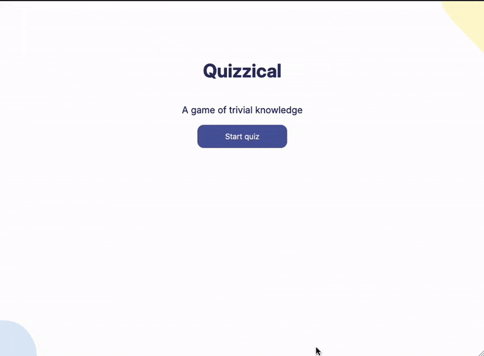
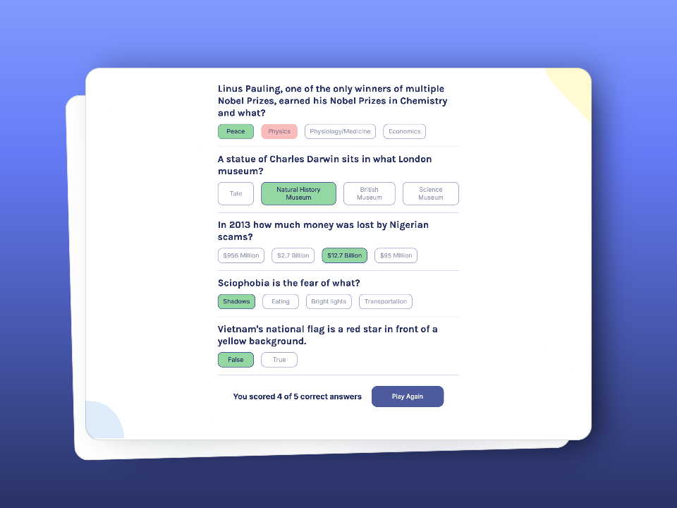

# Quizzical - Solo Project

## *Overview* 🧐
This project is part of the **"React Basics"** module from the [**Frontend Career Path**](https://v2.scrimba.com/the-frontend-developer-career-path-c0j) course on [**Scrimba**](https://v2.scrimba.com/home).

Quizzical is a React-based trivia game that leverages the [Open Trivia Database API](https://opentdb.com/api_config.php)
The Password Generator offers many of the same essential functions as: **1Password**, **Apple Keychain**, or **bitwarden**: The ability to create random passwords, up to 128 characters, to include/exclude special symbols or numbers, and "click-to-copy" for any password you create.

## *Requirements* 📝

✅ ~~Two screens (start & questions).~~

✅ ~~Pull 5 questions from the OTDB API.~~

✅ ~~Tally correct answers after "Check answers" is clicked.~~

✅ ~~Styled & polished.~~

✅ ~~Users can only select 1 answer for each question.~~

## *Screenshots* 📷

## *Links* 🔗

[Scrim code](https://v1.scrimba.com/scrim/coe7a402186d1470fb98be14c) 👈

[Live site](https://hairama-quizzical.netlify.app/) 👈

## *What I learned* 🤓

🔳 **Decoding HTML entities:** I used the `html-entities` package to decode strings returned from the OTDB API.

🔳 **Shuffling arrays:** Since the API returned the `correct answer` separately from the `incorrect answers` I needed a way to shuffle all of the possible answers into a **new** array. 

## **Future feature sets** 🔮

🎯 **More user controls** Allow the user to select the number of questions, difficulty, or categories

🎯 **User statistics** Show percentage of correct answers, broken down by category, and question difficulty

🎯 **Submit new questions** Build an interface for users to submit new trivia questions

## *Resources* 🗃️

🗃️ [Frontend Career Path](https://v2.scrimba.com/the-frontend-developer-career-path-c0j) by Scrimba
